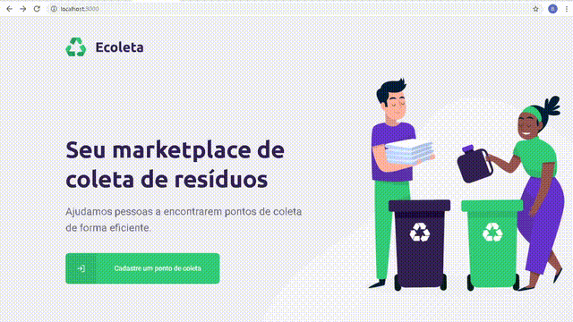
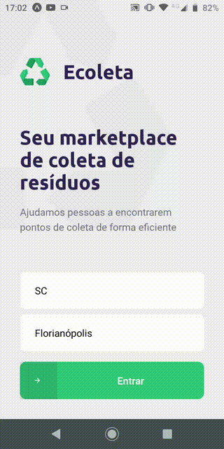

# Next Level Week - Rocketseat

This is my take on the free, week-long "Fullstack" development course made by the group _Rocketseat_.

### Task

Develop _Ecoleta_, a full-stack application for assisting in trash disposal and recycling. This single page application should assist in making recycling easier by letting users alert garbage collection companies of their well separated junk. It should include a point registration service, and a user mobile app for finding said points. It must all be integrated and use a maps API.

### Design document

The Landing page can be viewed on [Figma](https://www.figma.com/file/9TlOcj6l7D05fZhU12xWT3/Ecoleta-(Booster)?node-id=0%3A1).

### Previews

#### Web

[Click here to go to the web stack.](./aulas/web).

#### Mobile

[Click here to go to the mobile stack.](./aulas/mobile).

### Required Technologies so far

- Node.js
- TypeScript
- React.js
- React Native

#### Completion

- [x] Day 1 - Environment Setup 
- [x] Day 2 - Backend API Routing
- [x] Day 3 - Front End SPA, Form submission feature
- [x] Day 4 - Mobile Client, Point browser feature
- [x] Day 5 - Image Upload, Input checking for backend
- [ ] Bonus: Polish Mobile input
- [ ] Bonus 2: Deploy
